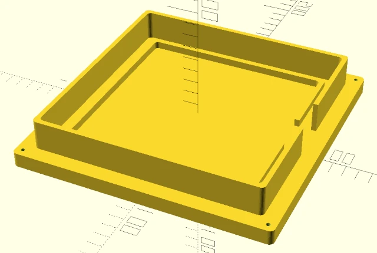
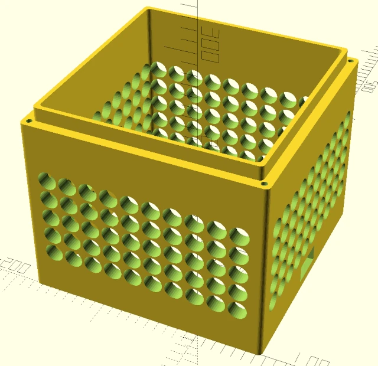
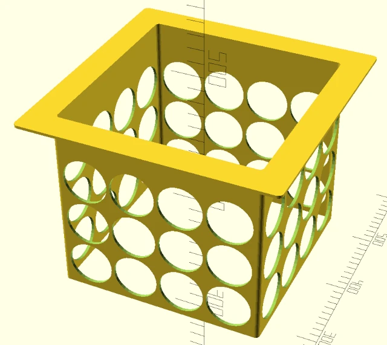
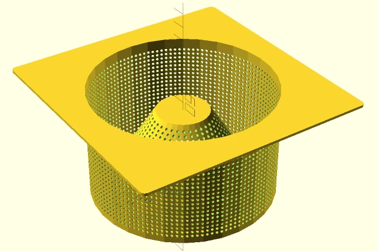
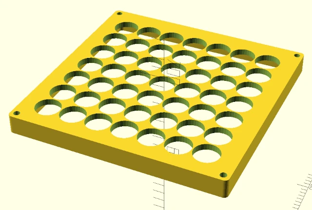
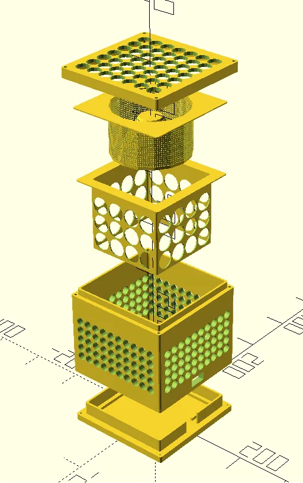

# Parametric Air Cleaner (WIP)

> Before assembling this, please consider occasionally opening a window in you room.

This model is designed to pull air trough light porous dust filter
and activated carbon pellets using fan of chosen size. In theory, it should
filter out dust and small particles from the room.

* [Project target](#project-target)
* [Project status](#project-status)
* [Variants](#variants)
* [Shopping List](#shopping-list)
* [Hardware](#hardware)
  * [Controls](#controls)
  * [Fan](#fan)
  * [Filters](#filters)
  * [Power](#power)
  * [Structure](#structure)
* [3D Printed Parts](#3d-printed-parts)
  * [Base](#base)
  * [Wall Frame](#wall-frame)
  * [Dust Filter Holder](#dust-filter-holder)
  * [Pellet Holder](#pellet-holder)
  * [Pellet Holder Lid](#pellet-holder-lid)
  * [Lid](#lid)
  * [Control Panel](#control-panel)
  * [The Big Picture](#the-big-picture)

## Project target

Create Bluetooth controlled smart home appliance. Currently in progress

## Project status

I have a working prototype, but there is still a lot of work unfinished.

* Thinner the walls to save material
* Design wiring holes for the fan
* Design the pellet lid, so the activated carbon does not fall trough the top when the PAC is tilted
* Design better controls holder in the main wall frame
* Research, specify and list additional hardware used (button, power converter, wiring)
* Finish programming the Bluetooth control
* Wire the 12 V power, so it can be reused for the RPI
* Design housing for the RPI
* Reduce box base height
* Improve Dust Filter Holder fitting, so it does not block cables
* Convert lid holes to circular pattern to hide some of the internal hardware
* Move the power button to the top

## Shopping list

(WIP)

* [SilverStone Air Penetrator 184i Pro](https://www.amazon.de/-/en/dp/B09FSWDP4R?ref=ppx_yo2ov_dt_b_fed_asin_title)
* [Raspberry Pi Pico W](https://www.amazon.de/-/en/Waveshare-Pre-Soldered-Pi-Pico-Microcontroller/dp/B0BN5YT8W6)

## Variants

1. Standalone with 12 V input
2. Buddy variant witth 4 pin fan connector, to be controlled by a single RPI

## Hardware

The model should reliably resize to the specified fan size.

### Controls

The PAC offers controlling the fan's RPM via PWM.

* Simple toggle switch for haptic control
* Raspberry Pi Pico W for [remote control](./control)

### Fan

  Any 12 V DC fan controlled by PWM (4pin connector). I used [18 cm SilverStone Air Penetrator](https://www.amazon.de/-/en/dp/B09FSWDP4R?ref=ppx_yo2ov_dt_b_fed_asin_title)

### Filters

* Activated carbon pellets as particle filter
* Porous foam for dust filter

### Power

* Any 12 V DC power adapter for main power
* 12 V DC relay

### Structure

* 3 mm screws and nuts (need to specify). The screws are optional, because the box holds together nicely.
* PETG/PLA 625 g

# 3D printed Parts

The parts fit together bottom to top. Print from any stable non-flex material,
the PAC should not go trough any high temperatures. I printed mine from PETG.

## Base

This is a stand that holds the Frame and the Dust Filter Holder. The base
surface does not need much infil, just make sure you give it enough to make nice
surfaces. However, the lips need to be stronger, so they do not crack when
inserting Wall Frame and Dust Filter Holder.

I used these Print settings for the base surface:

* Infill: 8 % Honeycomb
* Supports: None

And these for the lips:

* Infill: 25 % 3D Honeycomb

## Wall Frame

This is the large outside wall piece with air holes. It fits on top of the Base
around the outer lips.  It needs only a tiny bit of supports for the screw holes
at the bottom.

* Infill: 10 % 3D Honeycomb 
* Supports: Only on the print surface

If you want to make sure it holds, melt the screw nuts inside the frame's screw
nut holes both on top and the bottom. You can then screw the Base and the Lid to
the Wall Frame, however it should hold reliably even without the screws, when
you don't plan to play ball with the PAC.

## Dust Filter Holder

This part goes inside the Frame and it is just a thin frame to hold the dust
filter foam. It should fit inside the Base's inner lips. When inserting the
Holder, remember to stuff the foam around it.

* Direction: Upside down
* Infill: None
* Supports: None

## Pellet Holder

It is designed to hold the activated carbon inside. This part is tricky, because
it takes incredibly long to render in OpenSCAD and slice in sliser (sorry about
that). It is designed to be laid on top of the Dust Filter Holder. 

* Direction: Upside down
* Infill: None
* Supports: Manual / Only forced

Before printing, draw supports on the flat pieces to save material. The printer
should handle the angle.

Btw it kinda looks like the Colloseum.

## Lid

It should fit on top of the Wall Frame. You can use screws to tighten it on top
of the Wall Frame.

* Direction: Upside down
* Infill: Same as Wall Frame (it's kinda an extension of the frame)
* Supports: None

## Pellet Holder Lid

This part should prevent the pellets blocking the fan and falling trough the top
of the PAC.

TBD

## Control panel

This part should house the power input connector and the power switch button and
it should be fitted inside the Wall Frame, there is a hole for it.

TBD

---

## The Big Picture

